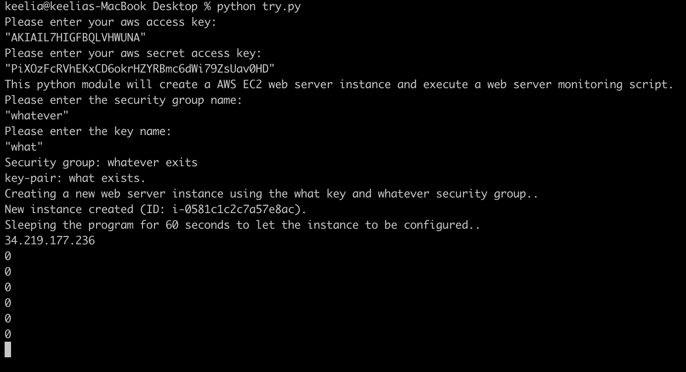
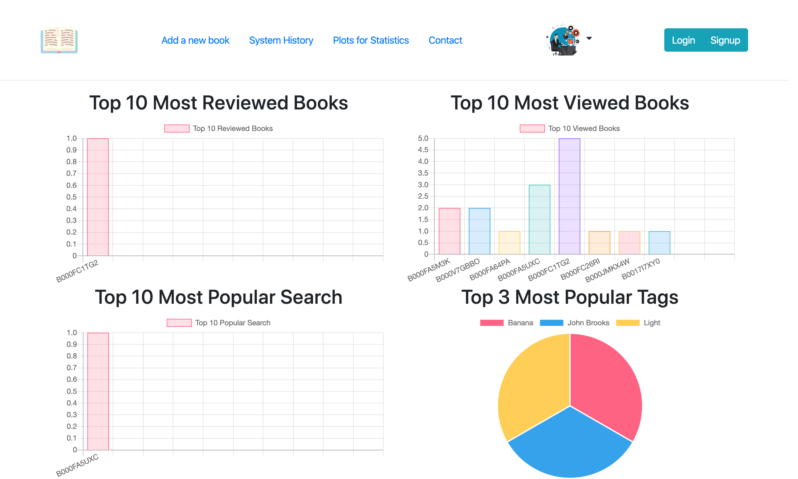
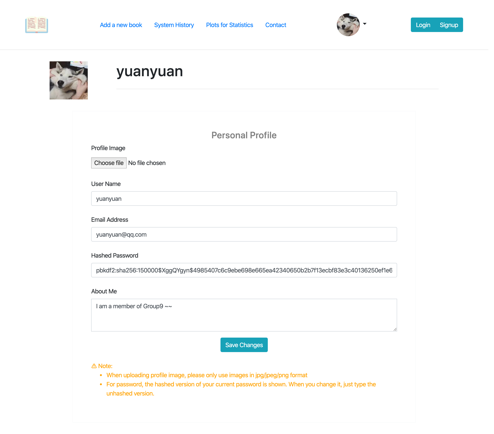
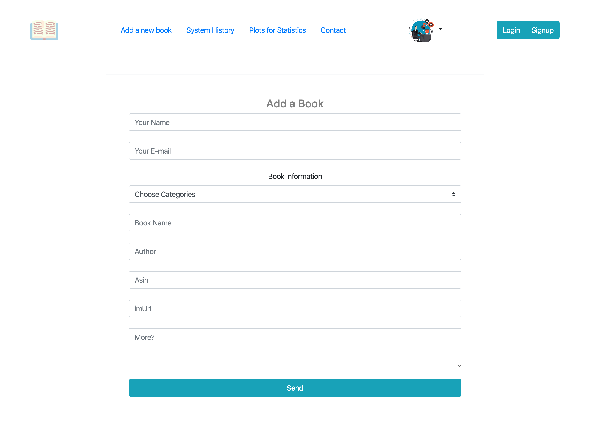
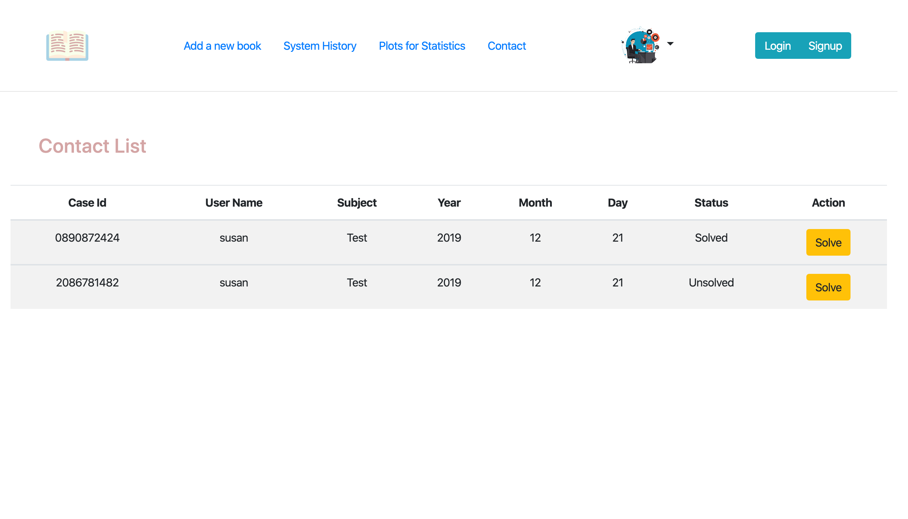
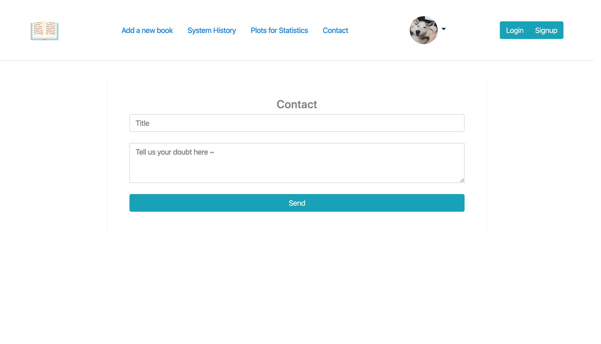
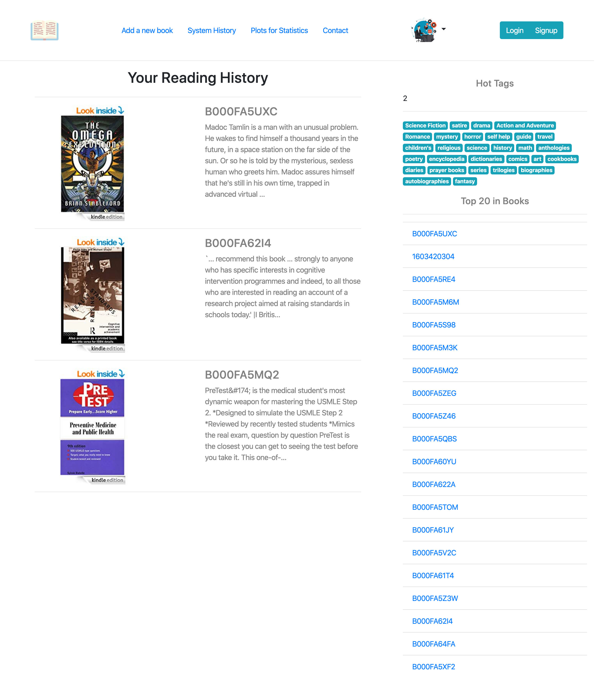
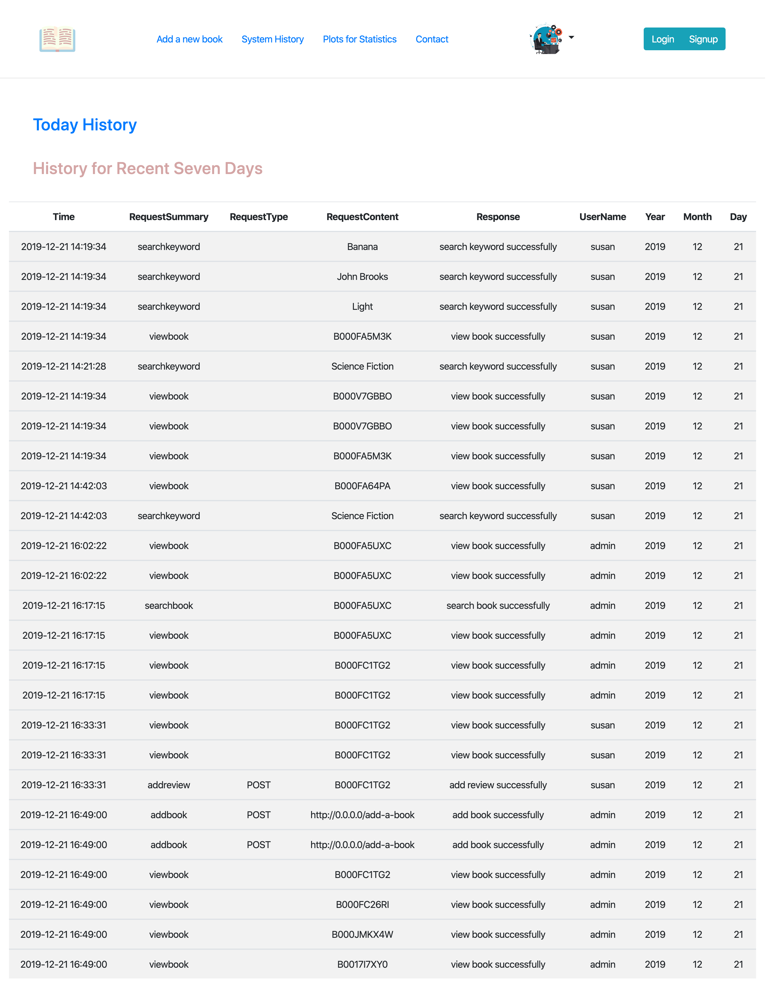
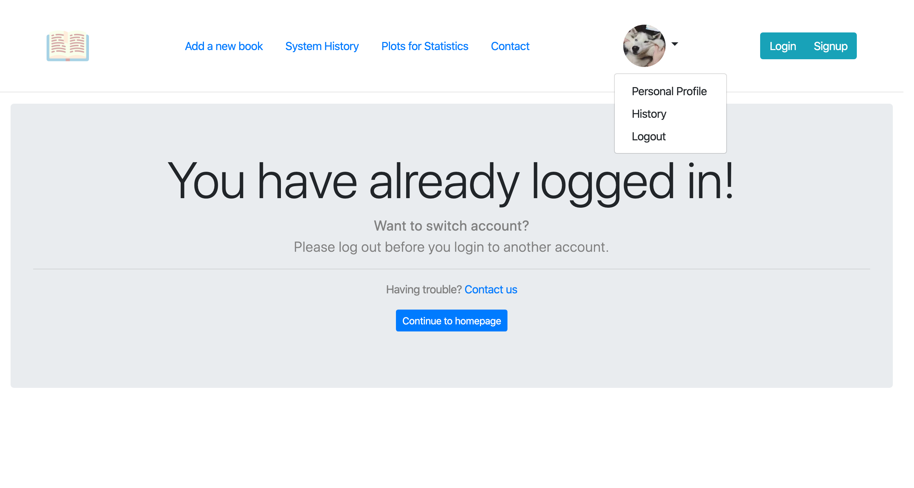

# ISTD 50.043 Book Review

In this project, we have built a web application for Kindle book reviews, one that is similar to Goodreads. We have started with some public datasets from Amazon, and design and implement your application around them.

## Getting Started

Demo: http://34.219.79.131/

⚠️⚠️⚠️ 

**PLEASE DO NOT TRY THE PROFILE PICTUALE UPLOADING FUNCTION becase after we put the s3 key pairs in public, AWS has deleted it without our permission. HOWEVER, IT DID WORK PERFECTLY WITH THE KEY BEFORE.**

**NOTE** You can login as admin by using 👉 username=admin , password=123

**NOTE** You can login as user by using 👉username=hi , password=cat

**NOTE** DO NOT register using any of the following information because they alrealy exist:

* username=susan

* username=random

* username=yuanyuan

* username=user

* email=susan@qq.com

* email=yuanyuan@qq.com

* email=user@qq.com

**NOTE** Before you login to another account make sure you log out (to log out, kindly click your profile and there is a dropdown button called Log out)

**NOTE** Be patient! It takes some time to load some pages, because we host our databases including server on us-west-2 region 

If you want to recreate by you own, follow the steps under **Automation Script**


### Prerequisites

What things you need to install

```
python3
flask
flask_sqlalchemy
flask_migrate
flask_login
flask_pymongo
mysql-connector-python
mysql-connector-python-dd
mysql-connector-python-rf
flask_mysqldb
flask_wtf
boto3
botocore
```

### Automation Scripts

Automate creating instances and host database aw well as the app itself on EC2

Clone or download a copy here and follow the steps:
1. Get an Amazon Web Service account at https://aws.amazon.com, record down your **Access Key ID** and **Secret Access Key**
2. Run automation script to get server up
In your terminal/cml
```
cd /50.043-project/automation\ script
python autoScriptForFrontEnd.py
```


⚠️ Note you MUST put "" around all the inputs e.g "your-secret-access-key"

⚠️ in case the security group in your account doesn't fullfil all the requirements then you can type in any name you want as your security group name, in the automation script, it will help you create a security group using the name you provided.

⚠️ same for key name, you'd better use the key in the same folder as the automation script, if cannot find any keys in the same folder, then just type any name for the key, the script will help you to create one.

3. Go to the IP address printed in the console to view the app

## Run it locally

Clone or download a copy here and follow the steps:
```
cd /50.043-project/flaskappDemo
python 50043-project.py
```
In your terminal/cml then go to 0.0.0.0

## Analytics System

All the related scripts as well as README are all in Analytics folder : [Analytics](https://github.com/yqyqyq123/50.043-project/blob/master/Analytics/Readme.md)

## Screenshots

### Home page

- new arrival is new added books by admin


### Plots for stastics

- one for searching ASIN
- one for searching key words
- one for reviewing books
- one for viewing books



### User/Admin edit profile



### Add a new book (for admin only)



### Contact (Admin side)

- Admin view messages from users



### Contact (User side)

- user send messages to admin



### History page:

- viewing history



### System history (for admin only)

- system history(logs) for admin



### Logout before login/signup




## Built With

* [Bootstrap](https://getbootstrap.com/) - The CSS web framework used
* [Flask](https://maven.apache.org/) - Micro web framework written in Python
* [AWS](https://aws.amazon.com) - Amazon Web Service


## Authors
* Gou Yuanyuan 1002972
* Li Yueqin 1002992
* Li Zihao 1002966
* Tang Xiaoyue 1002968
* Ng Jen Yang 1003007
* Yong Khai Sheen 1002789


