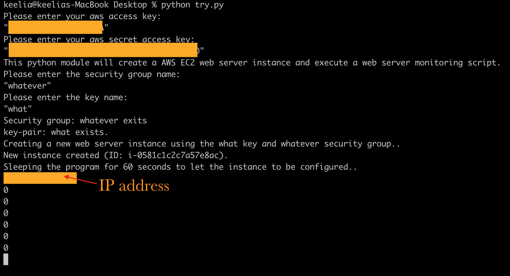

# ISTD 50.043 Book Review

In this project, we have built a web application for Kindle book reviews, one that is similar to Goodreads. We have started with some public datasets from Amazon, and design and implement your application around them.

## Getting Started

Demo: http://34.219.177.236/

If you want to recreate by you own, follow the steps under **Automation Script**


### Prerequisites

What things you need to install

```
flask
flask_sqlalchemy
flask_migrate
flask_login
flask_pymongo
mysql-connector-python
mysql-connector-python-dd
mysql-connector-python-rf
flask_mysqldb
flask_wtf
boto3
botocore
```

### Automation Scripts

Automate creating instances and host database aw well as the app itself on EC2

Clone or download a copy here and follow the steps:
1. Get an Amazon Web Service account at https://aws.amazon.com, record down your **Access Key ID** and **Secret Access Key**
2. Run automation script to get server up
In your terminal/cml
```
cd /50.043-project/automation\ script
python autoScriptForFrontEnd.py
```

3. Go to the IP address printed in the console to view the app


End with an example of getting some data out of the system or using it for a little demo

## Run it locally

@GYY

## Screenshots


## Built With

* [Bootstrap](https://getbootstrap.com/) - The CSS web framework used
* [Flask](https://maven.apache.org/) - Micro web framework written in Python
* @GYY


## Authors
* Gou Yuanyuan
* Li Yueqin
* Li Zihao
* Tang Xiaoyue
* JenYang 
* KS


